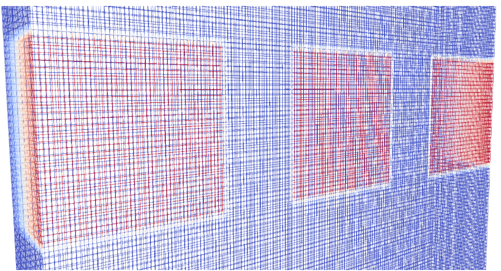
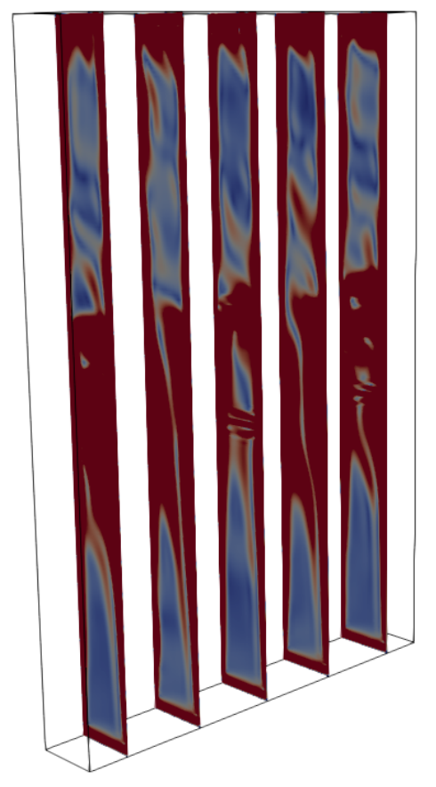

# What is fhdFoam? 

**fhdFoam** is an open-source package based on modifications of original openFoam solvers designed to simulate magnetic fluid flows in different scenarios based on the solution of ferrohydrodynamic (FHD) governing equations. In other words: fhdFoam is a set of OpenFOAM solvers for ferrohydrodynamic problems. 

Besides a set of solvers and tutorial cases, this repository includes pre-programmed python and bash scripts designed to provide a graphical user interface to handle pre and post-proccess funcionalities. These scripts interact with the user through a graphical user interface (GUI) asking questions that are used to configure the simulations by altering dictionaries of the tutorial cases.

The philosophy of the project can be summarized as *"one solver for each physics"*. Since the general set of governing equations of FHD can be quite complicated and subjected to different versions depending on the assumptions used to build the physical models, we believe that providing different solvers for different physics is not only practical but also pedagogical. The idea of different set of equations for different problems may serve as a mean to teach ferrohydrodynamics for fluid dynamicists which are not used to the inclusion of magnetic effects on the Newtonian version of the Navier-Stokes equations.

Currently, the project counts with the following solvers:

**magnetoconvectionFoam** - OpenFOAM solver for simulating the problem of thermomagnetic convection. This solver is based on the original buoyantBoussinesqPimpleFoam;

**intermagFoam** - OpenFOAM solver for simulating the motion of two immiscible phases where one of them is a magnetic fluid. Can be used to simulate magnetic drops being dragged by a magnetic field. This solver is based on the original interFoam;

**mhtFoam** - OpenFOAM solver for simulating the heating proccess of tumours subjected to magnetic hyperthermia. This solver is based on the original scalarTransportFoam;

**icomagFoam** - OpenFOAM solver, based on icomagFoam to solve the laminar magnetic fluid flow of a ferrofluid subjected to non-equilibrium magnetization dynamics using the classical Shliomis (1971) magnetization model;

You may find more information on the solvers in the README files included inside the corresponding folder for each solver.

# Pre-requisites

In order to use the full functionalities of this package, you must have the following programs installed in your system:

- openFoam v2306 or higher;
- paraview;
- python3 or higher;

In order to properly use the graphical functionalities provided by the scripts included in this package the user must also install the following python packages:

- matplotlib
- customtkinter

In order to install matplotlib you could type the following command in a terminal (for Debian/Ubuntu users):

`apt-get install python3-matplotlib`

To install customtkinter please type (for Debian/Ubuntu users):

`pip3 install customtkinter --break-system-packages`

# Configuration

## Solver's compilation

In order to compile a given solver you should type `wmake` inside a given's solver folder. But in order to run all functionalities of **fhdFoam** we recommend that you clone this repository inside openFoam's user folder. If you do not have this folder, please create it. When you first install openFoam this folder is not created by defacult and you should create it by typing the following command inside the openfoam bash (right after the openfoam installation):

`mkdir -p $FOAM_RUN`

Now, whenever you type: `ufoam` inside the openfoam bash it will direct you to this folder, where you should see a run folder.

Inside the openFoam user clone this repository with the following command: 

`git clone https://github.com/rafaelgabler/fhdFoam.git`

After clonning this repository inside this folder you should compile the projects solver by running the installation script. In order to do so please type: `./install.sh`

This will compile all the project's solvers. In order to run an individual case of a specific solver, you can look into the tutorials folder, which contains one or more corresponding cases for each solver. For each solver we include the case used to validate it. The documentation for the validation of each solver can be found in the individual README file of the corresponding solver.

## Graphical user interface

**fhdFoam** is intended to spread the ideas of ferrohydrodynamics trying to make this a more popular field of interest and research. In this sense, it is developed under the philosophy that it should be user friendly in a sense that people with no previous openFoam experience could play with it through a graphical user interface (GUI) and simulate interesting problems in the context of **FHD**.

After installing all the python packages and pre-requisites to use **fhdFoam** we can now play with our GUI. In order to do so just call the *fhdFoam.py* script located in the main folder of the project by typing:

`python3 fhdFoam.py`

Then, you just need to answer the questions that will appear on the windows in order to configure and run a given simulation.

## Gallery

Three magnet array used in the thermomagnetic convection problem simulated with magnetoconvectionFoam

  
 

## References

[1] Gontijo, Rafael Gabler, and Andrey Barbosa Guimarães. "Langevin dynamic simulations of magnetic hyperthermia in rotating fields." Journal of Magnetism and Magnetic Materials 565 (2023): 170171. 
[DOI: 10.1016/j.jmmm.2022.170171](https://doi.org/10.1016/j.jmmm.2022.170171).

[2] Tang, Yundong, et al. "Effect of nanofluid distribution on therapeutic effect considering transient bio-tissue temperature during magnetic hyperthermia." Journal of Magnetism and Magnetic Materials 517 (2021): 167391.[DOI: 10.1016/j.jmmm.2020.167391](https://doi.org/10.1016/j.jmmm.2020.167391).

[3] Alegretti, C. F., and R. G. Gontijo. "An experimental investigation of thermomagnetic convection in a tall enclosure subjected to progressive field gradients." International Communications in Heat and Mass Transfer 158 (2024): 107846. [DOI: 10.1016/j.icheatmasstransfer.2024.107846](https://doi.org/10.1016/j.icheatmasstransfer.2024.107846).

[4] Cunha, Lucas HP, et al. "A numerical study on heat transfer of a ferrofluid flow in a square cavity under simultaneous gravitational and magnetic convection." Theoretical and Computational Fluid Dynamics 34.1 (2020): 119-132.[DOI: 10.1007/s00162-020-00515-1](https://doi.org/10.1007/s00162-020-00515-1).