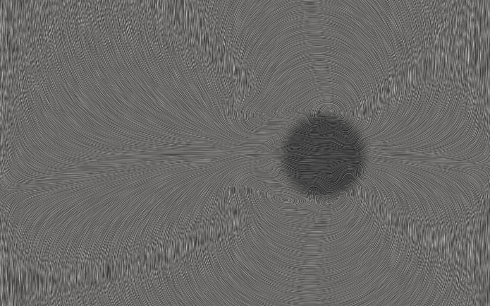

# What is fhdFoam? 

**fhdFoam** is an open-source package based on modifications of original openFoam solvers designed to simulate magnetic fluid flows in different scenarios based on the solution of ferrohydrodynamic (FHD) governing equations. In other words: fhdFoam is a set of OpenFOAM solvers for ferrohydrodynamic problems. 

Besides a set of solvers and tutorial cases, this repository includes pre-programmed python and bash scripts designed to provide a graphical user interface to handle pre and post-proccess funcionalities. These scripts interact with the user through a graphical user interface (GUI) asking questions that are used to configure the simulations by altering dictionaries of the tutorial cases.

The philosophy of the project can be summarized as *"one solver for each physics"*. Since the general set of governing equations of FHD can be quite complicated and subjected to different versions depending on the assumptions used to build the physical models, we believe that providing different solvers for different physics is not only practical but also pedagogical. The idea of different set of equations for different problems may serve as a mean to teach ferrohydrodynamics for fluid dynamicists which are not used to the inclusion of magnetic effects on the Newtonian version of the Navier-Stokes equations.

Currently, the project counts with the following solvers:

**magnetoconvectionFoam** - modified openFOAM solver for simulating the problem of thermomagnetic convection. This solver is based on the original buoyantBoussinesqPimpleFoam and can be quite usefull to understand the behavior of a magnetic fluid subjected to both temperature and magnetic field gradients [3,4];

**intermagFoam** - modified openFOAM solver for simulating the two-phase motion of a mixture of a magnetic fluid with a non-magnetic one. This solver is based on the original interFoam and can be used to simulate the behavior of magnetic oil drops being dragged by a magnetic field for example;

**mhtFoam** - modified openFOAM solver for simulating the heating proccess of tumours subjected to magnetic hyperthermia. This solver is based on the original scalarTransportFoam. More information about the physics behind magnetic hyperthermia, please consult Refs [1,2];

**icomagFoam** - modified openFOAM solver, based on the classical icoFoam to solve the laminar magnetic fluid flow of a ferrofluid subjected to non-equilibrium magnetization dynamics using the classical Shliomis (1971) magnetization model. This is an interesting solver to explore mathematical clousure models in the context of non-equilibrium ferrohydrodynamics. For more about the mathematical formulation used in icomagFoam please consult Ref[5];

You may find more information on the solvers in the README files included inside the corresponding folder for each solver.

# Pre-requisites

In order to use the full functionalities of this package, you must have the following programs installed in your system:

- [openFoam v2306 or higher](https://develop.openfoam.com/Development/openfoam/-/wikis/precompiled).;
- paraview;
- python3 or higher;

In order to properly use the graphical functionalities provided by the scripts included in this package the user must also install the following python packages:

- matplotlib
- customtkinter

In order to install matplotlib you could type the following command in a terminal (for Debian/Ubuntu users):

`sudo apt-get install python3-matplotlib`

To install customtkinter please type (for Debian/Ubuntu users):

`pip3 install customtkinter`

# Configuration

## Solver's compilation

First, clone this repository in your local folder by typing:

`git clone https://github.com/rafaelgabler/fhdFoam.git` 

Then, you must compile the solvers of the project. For this purpose you should enter inside the openfoam bash and in the main folder of the project type:

` ./install.sh`

This command will compile all the project's solvers. In order to run an individual case of a specific solver, you can look into the tutorials folder, which contains one or more corresponding cases for each solver. For each solver we include the case used to validate it. The documentation for the validation of each solver can be found in the individual README file of the corresponding solver.

## Graphical user interface

**fhdFoam** also comes with a graphical user interface (GUI). This GUI is developed based on the idea that people with no previous openFoam experience could play with **fhdFoam** using a simple graphical user interface (GUI) that will configure the scenario the user wants to simulate. So more people can simulate interesting problems in the context of **FHD**.

After installing all the python packages and pre-requisites to use **fhdFoam** you may call *fhdFoam's GUI* by typing inside the main folder: 

`./fhdFoam.sh`

Then, you just need to answer the questions that will appear on the windows in order to configure and run a given simulation.

## Running the simulations manually

In order to run the simulations manually, once you have compiled the solvers of the project you just need to copy the tutorial cases to your user folder and edit manually the configuration files. All cases come with *Allrun*, *Allclean* and *Allpre* scripts in order to help the user with the necessary procedures to run each simulation scenario.

# Gallery

Bellow we show the mesh used for the 3D cavity problem associated with thermomagnetic convection using a three magnet array to induce the magnetic field simulated with magnetoconvectionFoam

Here we may see a partial obstruction of the flow in the region of action of the magnetic field.

  
 

Bellow we can see the vortex induced by the motion of a magnetic drop being carried by the action of an external magnetic field in a simulation performed with intermagFoam.

  
 

## References

[1] Gontijo, Rafael Gabler, and Andrey Barbosa Guimarães. "Langevin dynamic simulations of magnetic hyperthermia in rotating fields." Journal of Magnetism and Magnetic Materials 565 (2023): 170171. [DOI: 10.1016/j.jmmm.2022.170171](https://doi.org/10.1016/j.jmmm.2022.170171).

[2] Tang, Yundong, et al. "Effect of nanofluid distribution on therapeutic effect considering transient bio-tissue temperature during magnetic hyperthermia." Journal of Magnetism and Magnetic Materials 517 (2021): 167391. [DOI: 10.1016/j.jmmm.2020.167391](https://doi.org/10.1016/j.jmmm.2020.167391).

[3] Alegretti, C. F., and R. G. Gontijo. "An experimental investigation of thermomagnetic convection in a tall enclosure subjected to progressive field gradients." International Communications in Heat and Mass Transfer 158 (2024): 107846. [DOI: 10.1016/j.icheatmasstransfer.2024.107846](https://doi.org/10.1016/j.icheatmasstransfer.2024.107846).

[4] Cunha, Lucas HP, et al. "A numerical study on heat transfer of a ferrofluid flow in a square cavity under simultaneous gravitational and magnetic convection." Theoretical and Computational Fluid Dynamics 34.1 (2020): 119-132. [DOI: 10.1007/s00162-020-00515-1](https://doi.org/10.1007/s00162-020-00515-1).

[5] de Carvalho, Douglas Daniel, and Rafael Gabler Gontijo. "Magnetization diffusion in duct flow: The magnetic entrance length and the interplay between hydrodynamic and magnetic timescales." Physics of Fluids 32.7 (2020). [DOI: 10.1063/5.0011916](https://doi.org/10.1063/5.0011916). 