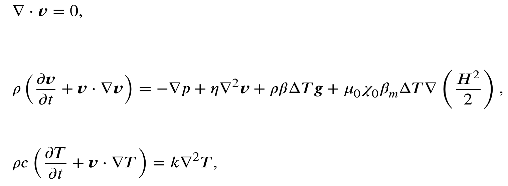
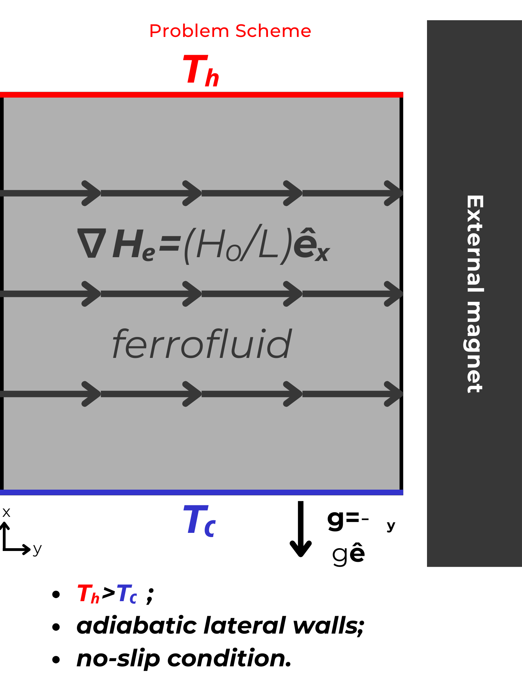
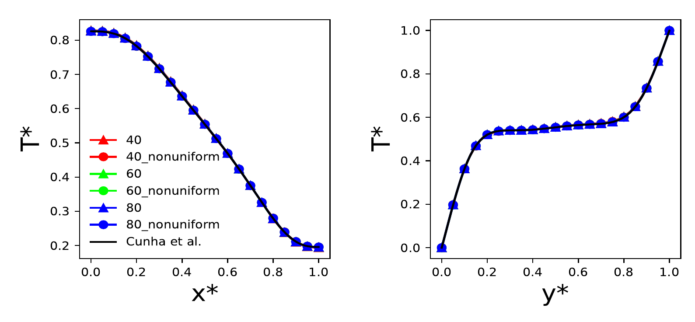
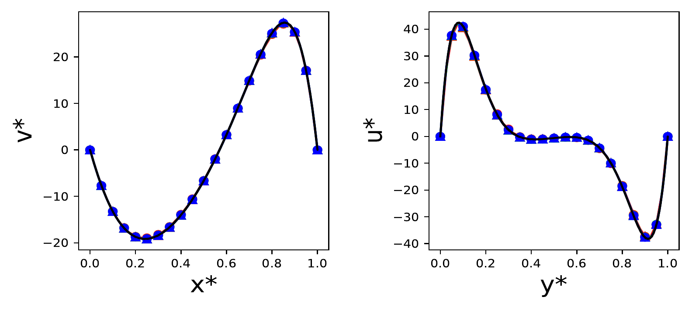

# magnetoconvectionFoam 

OpenFOAM based solver for simulating the flow induced by thermomagnetic convection of a magnetic fluid subjected to both temperature and magnetic field gradients. This solver is based on the original buoyantBoussinesqPimpleFoam;

## Governing Equations

The governing equations solved by **magnetoconvectionFoam** are given by:

  
 

where $\rho$, $\eta$, $c$ and $k$ denote the local values of density, dynamic viscosity, specific heat and thermal conductivity of the magnetic fluid respectively. In this formulation we assume that the fluid behaves as a superparamagnetic fluid, where its magnetization $\vec{M}$ is defined by $\vec{M} = \chi \vec{H}$, being $\chi$ the fluid's magnetic susceptibility and $\vec{H}$ the local applied magnetic field. We consider that $\chi$ is mostly affected by temperature and use an equivalent Boussinesq's approximation to define a magnetic pyrometric like coefficient $\beta_m = -(1/\chi_0) \partial \chi/\partial T$, inspired by the classic pyrometric coefficient $\beta = -(1/\rho_0) \partial \rho/\partial T$. Also, $p$, $\bm{v}$ and $T$ are respectively the pressure, velocity and temperature fields, while $H^2 = \vec{H} \cdot \vec{H}$. Finally, $\mu_0 = 4 \pi \times 10^{-7} H/m$ is the magnetic permeability of the free space, $\chi_0$ is a reference magnetic susceptibility and $\Delta T$ stands for the temperature difference between the walls. For more details regarding the mathematical formulation used in the development of **magnetoconvectionFoam** please consult Refs [1,2].

## Solver validation

In order to validate this solver we consider the work of Cunha et al. [2] where the authors performed numerical simulations of a square cavity subjected simultaneously to gravitational and magnetic convection. In this work the authors have perfomed their simulations using an academic Finte element research code written in FORTRAN.

 Bellow we present a sketch of the problem's boundary conditions used here for validation purposes based on Ref. [2]. 

  
 

A comparison between the velocity fields, temperature profiled and velocity component profiles for both codes (magnetoconvectionFoam and the code developed by Cunha et al. [2]) is presented bellow.

  
 

  
 

  
 

## References

[1] Alegretti, C. F., and R. G. Gontijo. "An experimental investigation of thermomagnetic convection in a tall enclosure subjected to progressive field gradients." International Communications in Heat and Mass Transfer 158 (2024): 107846. [DOI: 10.1016/j.icheatmasstransfer.2024.107846](https://doi.org/10.1016/j.icheatmasstransfer.2024.107846).

[2] Cunha, Lucas HP, et al. "A numerical study on heat transfer of a ferrofluid flow in a square cavity under simultaneous gravitational and magnetic convection." Theoretical and Computational Fluid Dynamics 34.1 (2020): 119-132.[DOI: 10.1007/s00162-020-00515-1](https://doi.org/10.1007/s00162-020-00515-1).