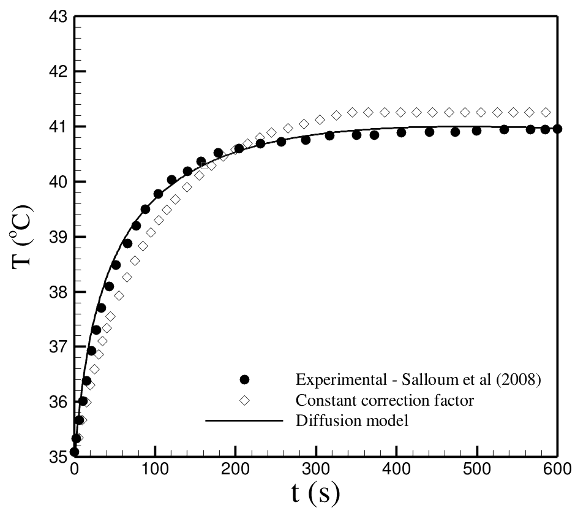

# mhtFoam

OpenFOAM based solver for simulating the temperature field of a biological tissue subjected to magnetic hyperthermia. This solver is based on the original scalarTransportFoam;

## Governing Equations

$$
\rho c \frac{\partial T}{\partial t} = k \nabla^2 T - \rho_b c_b \omega_b (T - T_b) + \dot{Q}_m + \Phi \mu_0 \pi H_0^2 \chi^{''} f \\
\frac{\partial \Phi}{\partial t} = \mathcal{D}\nabla^2\Phi
$$
where $\rho$, $c$ and $k$ denote the local values of density, specific heat and thermal conductivity of the biological tissues involved respectively, $\rho_b$, $c_b$, $\omega_b$ and $T_b$ represent density, specific heat, perfusion rate and arterial temperature of the blood, $T(\vec{x},t)$ and $\Phi (\vec{x},t)$ represent temperature and normalized particle concentration fields, $\dot{Q}_m$ is the metabolic heat generation rate of the biological tissue, $\mu_0 = 4 \pi \times 10^{-7} H/m$ is the magnetic permeability of the free space, $H_0$ is the mean value of the applied field, $f$ is the frequency of the time-dependent field in Hz, $\mathcal{D}$ is a calibrated diffusion-like coefficient that accounts for the time the initial ferrofluid mass takes do spread around the surrounding tissues and finally $\chi^{''}$ is a dynamical property of the ferrofluid namely the imaginary part of the complex susceptibility. For details regarding the mathematical formulation used in the development of **mhtFoam** please consult Refs [1,2]

The blood perfusion rate is estimated according to the kind of biological tissue. For the tumour tissue, we have:

$$
\omega_{b}(T)=\left\{ \begin{array}{ll}
8.33\times{10^{-4}}~,~~~T<37^{o}C\\
\\
8.33\times{10^{-4}}-\bigl[(T-37)^{4.8}\bigr]/5.438\times{10^{6}}~,\\
37^{o}C<T<42^{o}C\\
\\
4.16\times{10^{-4}}~,~~~T>42^{o}C\\
\end{array}\right.
$$

for the healthy tissue we have

$$
\omega_{b}(T)=\left\{ \begin{array}{ll}
3.55\times{10^{-3}}\exp\big[-(T-45)^{2}/12\bigr]~+\\
4.5\times{10^{-4}}~,~~~T\leqslant 45^{o}C\\
 \\
0.004~,~~~T\geqslant 45^{o}C.\\
\end{array}\right.
$$

These equations were proposed by Ref [3].

## Solver validation

In order to validate this solver we consider the experimental database of Salloum et al [4]. In this work the authors perform an *in-vivo* experimental study of the heating process of a mouse subjected to magnetic hyperthermia. Since we propose a time-dependent diffusion-like equation to emulate the process of ferrofluid spreading through the biological tissues, we must calibrate the values of this ad-hoc constant $\mathcal{D}$. In **mhtFoam** This constant is calibrated in order to provide a typical spreading time compatible with the time-dependent behavior of the temperature availed at the center of a spherical tumour according to the experimental data of Salloum et al.[4]. Bellow we present a comparison between the experimental data of Salloum et al.[4] with the numerical prediction provided by **mhtFoam**

  
 

## References

[1] Gontijo, Rafael Gabler, and Andrey Barbosa Guimarães. "Langevin dynamic simulations of magnetic hyperthermia in rotating fields." Journal of Magnetism and Magnetic Materials 565 (2023): 170171. 
[DOI: 10.1016/j.jmmm.2022.170171](https://doi.org/10.1016/j.jmmm.2022.170171).

[2] Tang, Yundong, et al. "Effect of nanofluid distribution on therapeutic effect considering transient bio-tissue temperature during magnetic hyperthermia." Journal of Magnetism and Magnetic Materials 517 (2021): 167391.[DOI: 10.1016/j.jmmm.2020.167391](https://doi.org/10.1016/j.jmmm.2020.167391).

[3] Lang, Jens, Bodo Erdmann, and Martin Seebass. "Impact of nonlinear heat transfer on temperature control in regional hyperthermia." IEEE Transactions on Biomedical Engineering 46.9 (1999): 1129-1138. [DOI: 10.1109/10.784145](https://ieeexplore.ieee.org/document/784145).

[4] Salloum, Maher, Ronghui Ma, and Liang Zhu. "An in-vivo experimental study of temperature elevations in animal tissue during magnetic nanoparticle hyperthermia." International Journal of Hyperthermia 24.7 (2008): 589-601. [DOI: 10.1080/02656730802203377](https://doi.org/10.1080/02656730802203377).